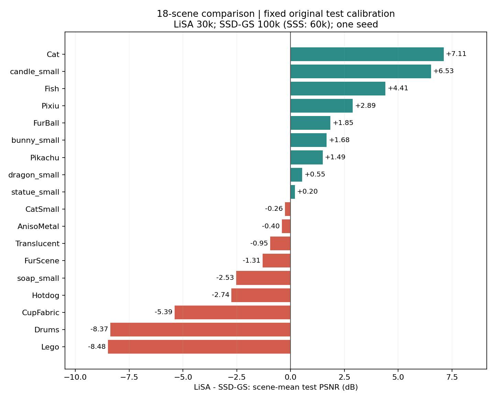
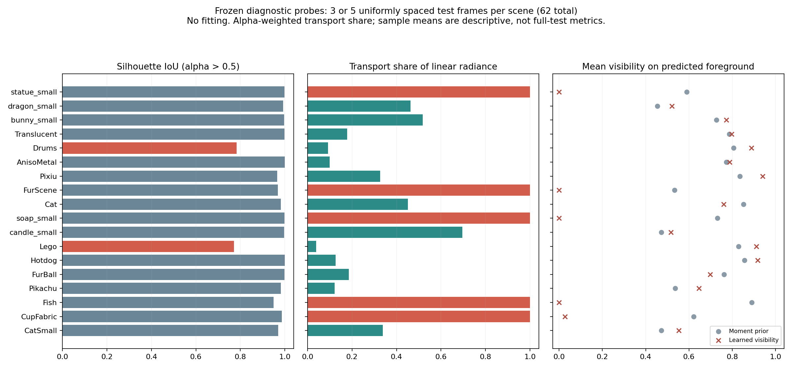
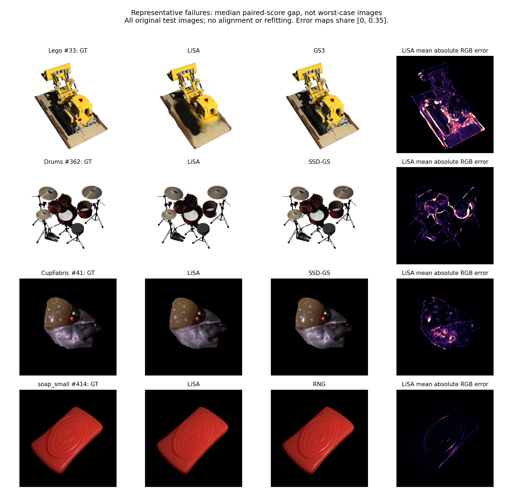

# LiSA 全18场景结果与问题诊断

分析日期：2026-10-03（JST）。用户已明确恢复分析，要求判断SOTA、查找原因并提出方案，先不实施改进。本轮只复核已有结果、做冻结模型前向诊断及生成派生分析；没有训练、微调、改参数或改变模型/评价实现。

[SOTA核查](../research/sota_assessment.md) · [改进提案（未实施）](../research/improvement_proposal.md) · [正式结果](results.md) · [中央四方法总表](../../../benchmarks/full_dataset_comparison/RESULTS.md)

## 1. 结论

LiSA尚不能宣称全面SOTA。在当前固定原始测试标定的四方法比较中，它在Real_NRHints与Synthetic_SSS-GS的三项平均指标领先，总体SSIM/LPIPS领先；总体PSNR第三，低于SSD-GS 0.2059 dB、低于GS³ 0.1125 dB。Synthetic_GS3是主要短板。

两个优先调查方向已有直接证据：

1. **Lego、Drums的几何覆盖异常**：预测轮廓明显向背景扩张、细节被大块外观替代；很早接近高斯数量上限，后续细化空间受限。
2. **多个场景的局部材质分支退化**：CupFabric、FurScene、Fish、soap_small、statue_small的均匀抽查帧中，可见度和局部响应接近零，传输分支承担几乎全部前景辐射。

这两项是当前模型状态的观测事实。训练日程、增密策略、梯度竞争、材质方向容量对PSNR的具体因果贡献，仍需后续受控实验确认。

## 2. 证据复核与口径

- 重新运行既有collector，72/72项通过：官方test帧数与顺序、有限逐帧指标、聚合均值、最终权重、保存图像完整性。共22,764次测试图评价，即每种方法5,691帧。
- 额外读取18个LiSA最终权重：全部step=30,000、seed=0、svbrdf；fit_indices恰好覆盖各自官方train，val_indices为空；没有init_checkpoint、init_geometry、material_decoder或surface_priors依赖。
- 三份LiSA训练源码归档的八个关键文件与当前文件逐字节相同：methods/light_atlas.py、renderer.py、train.py、evaluate.py、data.py、refinement.py、gaussians.py、training/options.py。
- 训练预算：LiSA 30k；GS³ 100k；RNG 30k+70k；SSD-GS Real/GS3 100k、SSS 60k。迭代数不同，不能称等训练预算；迭代数也不能代替GPU时间。
- Real/GS3最长边512px，SSS256px；GS3白背景，其余黑背景；原始测试相机/灯位，无测试拟合；固定最终权重。指标先按帧平均，再按场景等权。
- 采用项目现有PSNR、SSIM、VGG LPIPS口径。历史六场景曾参与研发观察，不能称全程独立盲测。单种子结果没有跨训练随机性的误差条。

复核命令，在工作区根目录执行：

    /workspace/ubuntu2004_cuda12_1/utils/conda-envs/ssd-gs/bin/python benchmarks/collect_results.py --manifest benchmarks/full_dataset_comparison/comparison_manifest.json

### 额外发现：GT预处理不是逐像素完全一致

四方法分辨率和显示域一致，但LiSA与baseline保存的GT在部分Real/SSS图像存在小幅重采样/量化差异。为判断其影响，本轮仅用CPU将三个baseline全部17,073张已有预测PNG，对LiSA保存的官方GT重新计算PSNR；没有重新推理，也没有覆盖正式指标。

| 方法 | 原表总体PSNR | 同一LiSA GT重计PSNR |
| --- | ---: | ---: |
| LiSA | 31.3760 | 31.3760（原指标） |
| GS³ | 31.4885 | 31.4908 |
| SSD-GS | 31.5819 | 31.5857 |
| RNG | 25.8328 | 25.8283 |

排名不变；LiSA对SSD-GS差距变为约0.2097 dB。逐场景PSNR变化最大约0.0406 dB，不能解释Lego/Drums/CupFabric的大差距；GS3合成场景的保存GT完全一致。SSIM/LPIPS未按该额外口径重算，其领先结论限定于原表。未来正式投稿表应统一GT生成过程。

原始结果、CPU重计表与差异量位于[canonical_target_psnr.json](../../runs/light_atlas_analysis_20261003/canonical_target_psnr.json)。这是一项口径敏感性检查，不是新方法结果。

## 3. 最新完整成绩

| 方法 | 总体PSNR ↑ | SSIM ↑ | LPIPS ↓ |
| --- | ---: | ---: | ---: |
| LiSA | 31.3760 | **0.9431** | **0.0646** |
| GS³ | 31.4885 | 0.9393 | 0.0687 |
| SSD-GS | **31.5819** | 0.9388 | 0.0682 |
| RNG | 25.8328 | 0.8932 | 0.1304 |

LiSA相对SSD-GS：PSNR −0.2059、SSIM +0.004224、LPIPS −0.003579；相对GS³：−0.1125、+0.003809、−0.004079。逐场景第一名次数分别为PSNR 8/18、SSIM 11/18、LPIPS 11/18。

| 数据集 | LiSA PSNR / SSIM / LPIPS | PSNR最高的baseline | LiSA PSNR差值 |
| --- | --- | --- | ---: |
| Real_NRHints，7场景 | 28.4729 / 0.9072 / 0.0988 | GS³ 27.2736 | +1.1993 |
| Synthetic_GS3，6场景 | 28.3498 / 0.9480 / 0.0622 | GS³ 31.9732 | −3.6234 |
| Synthetic_SSS-GS，5场景 | 39.0717 / 0.9874 / 0.0196 | SSD-GS 37.7869 | +1.2848 |

Lego和Drums合计解释Synthetic_GS3对GS³净PSNR差距的82.85%，对SSD-GS净差距的88.28%。它们对18场景总体均值差值的贡献分别为−1.0007 dB（对GS³）和−0.9360 dB（对SSD-GS）。这些是差值的算术分解，不是删去困难场景后的正式成绩。

### 逐场景相对最强baseline

每行baseline按该场景平均PSNR选定，而非逐帧换对手。逐帧胜率是描述性统计，不能当作独立训练重复。

| 场景 | LiSA PSNR | 最强baseline | PSNR差值 | 胜出测试帧 |
| --- | ---: | --- | ---: | ---: |
| Lego | 21.2351 | GS³ | −9.6709 | 0/400 |
| Drums | 23.1751 | SSD-GS | −8.3661 | 0/400 |
| CupFabric | 30.6019 | SSD-GS | −5.3922 | 0/145 |
| soap_small | 35.8331 | RNG | −4.4520 | 20/500 |
| Hotdog | 30.2002 | GS³ | −3.1151 | 61/400 |
| FurScene | 23.8440 | GS³ | −2.2464 | 18/85 |
| Translucent | 31.0396 | GS³ | −1.7169 | 39/400 |
| AnisoMetal | 27.5993 | SSD-GS | −0.4013 | 144/400 |
| CatSmall | 33.5302 | SSD-GS | −0.2584 | 64/158 |
| statue_small | 36.1847 | GS³ | −0.2450 | 213/500 |
| dragon_small | 37.9232 | SSD-GS | +0.5460 | 371/500 |
| FurBall | 36.8497 | GS³ | +1.0177 | 375/400 |
| Pikachu | 32.1703 | GS³ | +1.0237 | 144/200 |
| bunny_small | 40.1564 | SSD-GS | +1.6764 | 396/500 |
| Pixiu | 26.2828 | GS³ | +2.5609 | 60/71 |
| candle_small | 45.2610 | RNG | +3.3472 | 499/500 |
| Fish | 27.6822 | RNG | +3.5668 | 63/66 |
| Cat | 25.1991 | RNG | +4.2095 | 66/66 |

## 4. 冻结前向诊断

复用现有模型加载、渲染、材质、图集与传输函数，在torch.no_grad下分析18场景62帧。每场景取test索引0、中间、末帧；Lego/Drums/CupFabric/soap_small额外取1/4、3/4位置。所有62帧预测量化后与已有PNG逐像素相同，模型没有被改变。环境仍为ssd-gs、PyTorch2.4.1/CUDA12.1、RTX6000Ada，使用GPU2，任务已结束。

另复用diagnose_image_errors.py的light-atlas-preview入口，输出四个重点场景各两个视角的图集、分解与原始buffer；按逐帧PSNR差值选中位数及最差视角。分解重建误差最大2.3842e−7。它们与62帧均匀探针是不同的取样集合。

探针报告：[frozen_probes.json](../../runs/light_atlas_analysis_20261003/frozen_probes.json)。传输占比按实际alpha加权线性辐射计算；可见度均值仅在预测alpha>0.5区域计算。探针不是完整test均值。

### 4.1 几何覆盖与增密瓶颈

| 场景 | 完整test alpha L1 | 5帧轮廓IoU范围 | 误覆盖背景占全图面积 | 首次记录≥395k点 |
| --- | ---: | --- | --- | ---: |
| Lego | 0.10938 | 0.727–0.810 | 7.91%–11.77% | 2,900步 |
| Drums | 0.04605 | 0.732–0.845 | 3.59%–6.86% | 3,500步 |

两场景漏覆盖前景面积均很小（Lego≤0.016%、Drums≤0.031%全图面积），主要异常是**多出的覆盖**，不是只缺少细小物体。Lego底板/履带被光滑大块替代；Drums的轮廓与鼓面、高光细节同时受损。

代码可确认：Refinement._grow_gs在剩余容量为零时不做clone/split，grow先于prune；当前上限400k，25k停止细化。两场景早期就接近上限，支持“早期分配不佳、后期缺乏重分配”的解释，但尚未证明它是唯一原因。FurBall和Hotdog也接近400k却有约0.999的轮廓IoU，所以不能将达到点数上限本身当作失败判据。

renderer.py用alpha归一化的期望深度与混合特征生成单个接收点。在多层交叠、细结构和轮廓区域，该接收点可能落在真实表面之间。它会同时影响局部方向、法线和图集读取，是第二个结构性嫌疑；本轮没有GT深度或分层渲染反事实，不能量化其贡献。

### 4.2 局部材质分支退化

| 场景 | 均匀探针数 | 矩检验V均值 | 学习后V均值 | 传输占线性辐射 |
| --- | ---: | ---: | ---: | ---: |
| CupFabric | 5 | 0.6221 | 0.02646 | ≈100% |
| FurScene | 3 | 0.5340 | 2.65e−13 | ≈100% |
| Fish | 3 | 0.8905 | 5.81e−10 | ≈100% |
| soap_small | 5 | 0.7324 | 1.56e−8 | ≈100% |
| statue_small | 3 | 0.5903 | 4.38e−7 | ≈100% |

CupFabric局部rho均值约9.56e−17，soap约3.89e−8；其余三者也很小。学习可见度的logit残差均值约−12到−54，直接压倒原本不接近零的矩检验先验。这个结果不能用“全部像素都处于真实阴影”解释。

methods/light_atlas.py允许无界可见度残差，局部响应用softplus，局部与传输只由最终RGB共同监督。局部项同时被小V与小rho压制时，梯度恢复困难；传输可接管颜色拟合。传输核的显式视角输入只有n·v，没有完整视角方位编码，这使它不适合替代所有局部镜面响应。

**解释的边界**：没有真实的分量监督，以上比例不等于物理SSS比例；Fish即使出现这种退化仍领先本地所有baseline，因此分支退化不必然导致PSNR落后。我们确认了退化状态，提出其可能削弱高光/泛化，未证明修复后必然提高PSNR，也未定位退化发生的训练时刻。

### 4.3 高频高光不足

完整test的neutral-peak局部对比度比值（预测/GT）：Drums 0.302、CupFabric 0.450、Lego 0.448、AnisoMetal 0.698。相应峰值2px召回率约0.423、0.462、0.517、0.519。图像中金属条带、杯面亮点和织物反光偏暗/变宽，与这些指标一致。

soap_small的对比度比值仅0.040、召回率0.000220：完整test共45,427个GT亮峰像素，预测仅4个亮峰像素。它的轮廓IoU接近0.998，但几乎遗漏这类高光，与局部分支退化相吻合。这些是特定中性亮峰的描述性指标，不等同所有镜面能量，也不能独立区分法线错误和材质模型不足。

现有svbrdf局部头具有反射向量编码与各向同性SG提示，但没有显式切线方向的各向异性反射瓣；空间信息经8个显式系数调节方向响应。空间latent和法线也携带位置变化，不能将整个模型严格描述成全局rank=8。各向异性增强应在几何与分支恢复后单独验证。

### 4.4 阴影图集与训练时长

- 62帧探针的预测前景接收点在图集视锥外的比例均为0。当前没有“物体大面积落到atlas外”的证据；这不排除有限分辨率、遮挡层次或掠射角误差。
- 历史spatial头消融显示，Translucent部分侧光角度下per-Gaussian可见度更好，说明图集方案还有取样弱点。这是旧头/六场景证据，不能直接当作当前svbrdf困难场景的已证实原因。
- 日志的10k–15k/20k–25k/25k–30k平均训练loss：Lego 0.05436/0.05500/0.05101，Drums 0.02770/0.02903/0.02740，CupFabric 0.01632/0.01194/0.01198。部分错误长期存在，支持优先检查结构和优化过程；这些日志每100步只记随机抽样帧，不是固定验证集曲线，不能据此证明已完全收敛。
- 30k对100k预算差异是实在的证据缺口，但直接延长训练不保证修复已饱和的局部分支或25k后停止的细化。应安排独立等预算对照，不能先将差距全部归于步数。

## 5. 代表图与数据位置

下图按相对场景最强baseline的**中位数逐帧PSNR差值**选图，不是刻意选最差图。Lego#33、Drums#362、CupFabric#41、soap#414。GT是LiSA评价使用的GT；baseline原生GT的细小差异已在第2节量化。

- [完整派生统计](../../runs/light_atlas_analysis_20261003/summary_statistics.json)：18场景差值、胜率、日志窗口、点数与原始路径。
- [冻结探针](../../runs/light_atlas_analysis_20261003/frozen_probes.json)：62帧轮廓、可见度、局部响应、能量占比与atlas覆盖。
- [图像来源](../../runs/light_atlas_analysis_20261003/figure_provenance.json)：代表帧选择与原图路径。
- [Lego分解](../../runs/light_atlas_analysis_20261003/Lego/preview.json)、[Drums分解](../../runs/light_atlas_analysis_20261003/Drums/preview.json)、[CupFabric分解](../../runs/light_atlas_analysis_20261003/CupFabric/preview.json)、[soap分解](../../runs/light_atlas_analysis_20261003/soap_small/preview.json)：含既有诊断入口的精确命令；同目录保留PNG和NPZ。

原始数据、最终权重、训练配置、历史源码、图像与指标均保留。没有启动任何改进实验。
