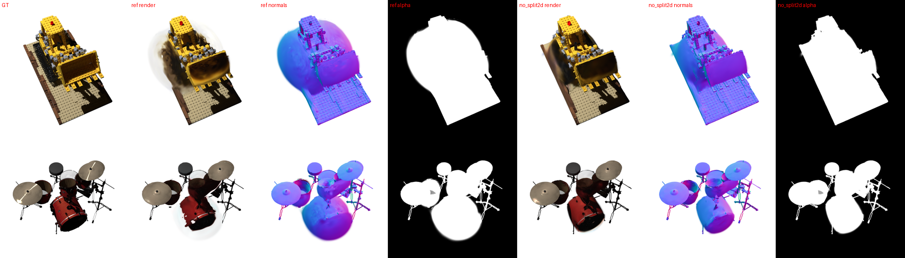

# LiSA v2：PSNR落后的根因、修复与重跑

日期：2026-10-04（JST）。用户要求彻底分析LiSA总体PSNR未超过前SOTA的原因、改进方法并重跑实验。
本页记录根因诊断证据与修复；留出光照选择与全18场景正式结果见文末两节。
上一轮诊断与提案：[full_dataset_analysis.md](full_dataset_analysis.md) · [improvement_proposal.md](../research/improvement_proposal.md)。

## 1. 结论

原先的两个P0假设（Lego/Drums几何覆盖异常、局部材质分支退化）都成立，但具体机制与提案的推测不同；两者均可由单一、可解释的训练动态问题解释，并已用单因素实验定位：

1. **Lego/Drums外壳由“梯度无关的屏幕足迹分裂”触发。** `train.py`自最早的PORT-GS版本起对屏幕半径超过图像3%的所有高斯无条件分裂，直到25k步（gsplat `refine_scale2d_stop_iter`，`grow_scale2d=0.03`）。它在1–3k步把点数推到400k上限，并在白背景复杂场景中生成不透明“外壳”：alpha误差从2k步起持续增长到训练结束。只关闭该规则即消除外壳；光源通道、阴影、传输都不是触发因素；提高上限到1M反而更糟。
2. **局部分支塌缩发生在训练最初约500步，而非后期竞争。** 黑背景场景中，20k个随机初始高斯覆盖整幅图（alpha L1≈0.8）。光度损失最便宜的下降方向是把*共享*材质MLP推入softplus饱和区，使所有覆盖像素变暗；约500步后背景被剪枝，但局部分支梯度已≈e^-40，不能恢复。2000步光源通道开启后，传输项接管全部外观；传输核只看`n·v`，镜面高光与布料光泽永久丢失。白背景场景压力方向相反（变亮），因此不塌缩。
3. CupFabric的5.4 dB差距**不是相机标定**：全局亚像素位移搜索对LiSA仅提升0.1–1 dB，最差视角与SSD-GS相差13 dB，误差集中在布料光泽与杯面高光，与第2点一致。

## 2. 证据

### 2.1 原18场景的alpha误差轨迹

训练日志`mask`项=0.05·mean|alpha−GT alpha|（每100步一个随机训练帧）。16个场景的alpha误差随训练单调下降；只有Lego、Drums从2k步开始单调**上升**直到结束（×1e−4）：

| 场景 | 1–2k | 2–3k | 3–5k | 5–10k | 10–20k | 20–30k |
|---|---:|---:|---:|---:|---:|---:|
| Lego | 7.5 | 18.8 | 19.1 | 25.4 | 31.5 | 38.5 |
| Drums | 7.4 | 8.1 | 14.1 | 14.5 | 16.1 | 21.9 |
| Hotdog（对照） | 2.0 | 1.3 | 1.3 | 0.8 | 0.6 | 0.7 |
| FurBall（对照） | 5.9 | 2.2 | 2.8 | 1.4 | 1.2 | 1.2 |

冻结最终权重在24个训练视角上：Lego平均多覆盖9.7%图像面积，Drums 5.0%，FurBall/Hotdog仅0.2%/0.1%；只有1.5%的Lego高斯中心落在背景，即外壳由物体附近的大足迹高斯构成，而非远处漂浮物。
法线渲染显示Lego下半部被一个光滑、alpha≈1的气球状外壳包住，履带和底板细节被藏在其后。
SSD-GS用47k/26k高斯拟合CupFabric/soap，而LiSA在约2k步就把两者推满400k上限。

### 2.2 外壳单因素诊断（Lego/Drums，8k前缀）

`runs/lisa_shell_diagnosis_20261004`：30k配方的前8k步（`--lr-decay-steps 30000`，学习率日程与30k完全相同），train内按光照角度组留出约10%帧，只评价留出光照，不渲染官方test。每个变体只改一个因素。

| 变体（Lego） | 2k点数 | mask 1–2k | 2–4k | 4–8k | 留出PSNR | 留出alpha L1 |
|---|---:|---:|---:|---:|---:|---:|
| ref（原配方） | 250k | 6.9 | 21.1 | 25.5 | 19.845 | 0.0609 |
| 无光源通道（local_only） | 252k | 6.8 | 20.7 | 26.0 | 18.394 | 0.0633 |
| 无阴影 | 251k | 6.9 | 21.6 | 25.7 | 19.949 | 0.0618 |
| 无传输 | 249k | 6.9 | 14.8 | 17.4 | 20.835 | 0.0408 |
| 仅矩检验可见度 | 246k | 6.8 | 16.2 | 14.3 | 19.903 | 0.0317 |
| mask权重0.5（×10） | 270k | 50.6* | 98.4* | 76.8* | 21.425 | 0.0163 |
| 上限1M | 252k | 6.8 | 25.0 | 54.7 | 17.874 | 0.1243 |
| **关闭2D足迹分裂** | **49k** | **4.0** | **3.6** | **3.3** | **21.680** | **0.0073** |

| 变体（Drums） | 2k点数 | mask 1–2k | 2–4k | 4–8k | 留出PSNR | 留出alpha L1 |
|---|---:|---:|---:|---:|---:|---:|
| ref | 146k | 6.4 | 12.8 | 16.8 | 22.050 | 0.0364 |
| 上限1M | 147k | 6.1 | 13.2 | 32.6 | 17.433 | 0.0861 |
| mask权重0.5 | 154k | 54.0* | 81.9* | 74.7* | 23.903 | 0.0159 |
| **关闭2D足迹分裂** | **37k** | **5.9** | **4.8** | **4.4** | **23.095** | **0.0108** |

\*mask项按10倍权重记录。只有关闭2D足迹分裂使alpha误差在光源通道开启后继续下降；无光源通道时外壳照样增长，排除阴影/传输触发。上限1M时外壳更大，排除“点数预算不足”。

### 2.3 局部分支塌缩的时间

`runs/lisa_collapse_diagnosis_20261004`（soap、CupFabric、FurScene，6k前缀，日志每100步记录可见度/局部/传输统计）。2000步光源通道开启后的第一条记录（2100步）即显示局部rho已经死亡，ref与关闭2D分裂均如此：

| 场景 | 变体 | 2100步 rho | 4–6k rho | 4–6k V | 4–6k 局部 | 4–6k 传输 |
|---|---|---:|---:|---:|---:|---:|
| soap | ref | 1.3e−26 | 5.9e−11 | 0.045 | 1.4e−13 | 0.082 |
| CupFabric | ref | — | 2.8e−15 | 0.033 | 4.4e−17 | 0.046 |
| FurScene | ref | 3.5e−36 | 5.5e−09 | 0.008 | 2.3e−17 | 0.075 |
| CupFabric | 关闭2D分裂 | 1.2e−19 | 0.015 | 0.020 | 4.7e−13 | 0.049 |

同一设置下（soap，128px，光源通道100步开启，300步冒烟）：原损失在200步内使rho=1.7e−41、背景覆盖始终未清除（alpha L1≈0.72）；只把背景像素的外观梯度去掉（见3.2）后rho保持0.05–0.12，背景覆盖200步内从0.14降到0.016，镜面瓣保持活跃。

注意：这批6k运行在第6000步保存，而该步恰好执行不透明度重置（每3000步，均值≈0.01），因此其留出指标无效，只使用训练日志动态。8k外壳诊断与所有30k运行不受影响（重置与细化在25k停止）。

### 2.4 CupFabric不是标定误差

对已保存的测试PNG做±3px、1/4px步长全局平移搜索（9个均匀视角）：LiSA最佳平移仅提升0.1–1.0 dB，SSD-GS提升0.3–4 dB；对齐后两者差距不变（例如视角36：LiSA 22.9 vs SSD-GS 37.1 dB）。CatSmall两方法有相同的数据级偏移，属于数据标定属性。

### 2.5 关闭2D足迹分裂后的晚期团块与增密统计量

30k变体D（关闭2D分裂+前景外观+镜面瓣）在Lego/Drums的**训练视角**PSNR只有20.90/21.58 dB（留出20.85/21.83），说明是欠拟合而非光照外推失败。
训练视角误差中有91–93%（部分视角）落在GT背景：一个暗色、光滑、越出轮廓的团块覆盖履带和底鼓，真实细节在其后从未形成。
团块由大高斯构成：Lego越界像素的alpha有94%来自最大尺度≥0.03R的高斯（53%来自0.06–0.1R，大量卡在`--max-scale 0.1R`上限；
该上限恰等于gsplat世界尺寸剪枝阈值0.1R，因此“过大高斯剪枝”实际永不触发）。点数自8k起停在约13万。

在D的最终Lego/Hotdog模型上按gsplat方式累计20个训练视角的absgrad：所有尺寸段的均值约1e−4、中位数2–6e−5，
比阈值0.0008低一个数量级，只有0.3–1%的高斯达标，且大高斯的梯度并不比小高斯大。
即LiSA的延迟着色使屏幕空间梯度远小于为RGB splatting标定的阈值，**原配方中真正承担增密的是梯度无关的2D足迹分裂**；
关闭它后增密实际停止。因此“按梯度排名+预算爬升”（变体E）也无法专门命中团块高斯：
11k步时E在Cat/CupFabric/FurScene与D无差别，在Drums更差（loss 0.0172 vs 0.0145，mask 5.8 vs 4.6），已提前停止。
200k点稠密初始化在约2k步被剪到与D相近的点数，早期动态与D一致，也已提前停止。两者的停止记录为SIGTERM，不是代码错误。

派生统计：[diagnostic_statistics.json](../../runs/lisa_v2_analysis_20261004/diagnostic_statistics.json)；图像来源：`runs/lisa_v2_analysis_20261004/shell_heldout_lego_drums.json`。

## 3. 修复（均为显式开关，默认值保持此前行为与checkpoint兼容）

1. `--split-scale2d-stop 0`：关闭梯度无关的2D足迹分裂，只保留基于梯度的克隆/分裂（与原始3DGS、GS³、SSD-GS一致）。
2. `--foreground-appearance`：前景辐射收到的光度梯度按GT alpha加权；GT背景像素只监督覆盖（alpha），不能驱动共享外观网络。所有三类数据都有GT alpha，训练已使用它作mask损失；评价不受影响。
3. `--specular lobes`（light_atlas方法字段）：在局部材质外加一组各向同性半程向量镜面瓣（锐度8…2048），RGB权重只依赖接收码与位置（与光照无关），由几何的0级矩阴影检验着色而不经过学习可见度残差。即使传输接管漫反射、学习可见度塌缩，高光仍有独立通路。

同时加入但未采用：`--visibility-bound`（学习可见度残差的有界版本）、`--budget-ramp`（点数上限线性增长）、`--grow-grad2d`、`--refine-start`。`run_benchmark.py`允许同一GPU列出多次（每GPU两个并发worker，吞吐约1.47倍）。

## 4. 训练内选择（不渲染官方test）

### 4.1 光照组留出（外推）：`runs/lisa_v2_selection_20261004` 及后续批次

8个开发场景（六个最大差距场景＋Cat/bunny两个LiSA占优对照），30k、seed0，train内按30°光照角度组留出约10%帧，只评价留出光照。
事先登记规则：8场景平均留出PSNR最高者入选，新增组件不得降低均值。

| 场景 | ref（原配方） | C：关2D分裂+前景外观 | D：C+镜面瓣 | F：保留2D分裂+前景外观+镜面瓣 | F2：F+预算爬升 |
|---|---:|---:|---:|---:|---:|
| Cat | **21.918** | 21.767 | 21.761 | — | — |
| CupFabric | **31.323** | 31.033 | 31.050 | — | — |
| Drums | **22.452** | 21.358 | 21.825 | 19.359 | 19.054 |
| FurScene | **24.380** | 24.377 | 24.371 | — | — |
| Hotdog | 30.001 | 31.521 | **31.573** | — | — |
| Lego | 20.500 | 20.820 | **20.849** | 18.617 | 18.369 |
| bunny_small | 37.902 | 37.945 | **38.066** | — | — |
| soap_small | 35.518 | **42.600** | 42.324 | — | — |
| **8场景均值** | 27.999 | 28.928 | **28.978** | 未完成 | 未完成 |

按事先规则D入选（+0.98 dB），但增益几乎全部来自soap（+6.8 dB，高光召回0.91）、Hotdog（+1.6）和Lego（+0.35）；
ref在Cat/CupFabric/Drums上仍更好。F/F2在Lego/Drums上明显更差，已在两场景完成后停止其余场景。
变体E（按梯度排名增长）、200k稠密初始化、提前开启光源通道（8k：Lego 21.73 vs 21.57，Drums 23.03 vs 23.20）均无改善，均提前停止或只做前缀。
变体B（只关2D分裂）在结论明确后取消：8个作业中6个刚启动即停止，2个以预建输出目录阻止启动（`CANCELLED.txt`）。

**同一批模型的训练视角PSNR（40个fit帧，能力指标）**：ref/D = Cat 30.97/29.59，CupFabric 38.11/37.29，Drums 22.41/21.58，bunny 42.76/42.19。
D在四个场景都拟合得更差：关闭2D分裂后点数只有18k–175k（ref约400k），按梯度的增密几乎不触发（见2.5），容量不足。

**协议问题**：光照组留出测的是光照外推（新颖度中位4–11°），官方test是近插值（test光与最近train光相差0–2°）。
原配方的外观几乎全由光源相对的传输项承担，外推退化平缓但插值拟合更差；两种协议可能给出相反排序。
因此在不接触test的前提下增加第二个选择：train内每10帧留1帧（offset 5）的插值划分，与官方test的相机/光照分布一致。

文件：[light_split_selection.json](../../runs/lisa_v2_analysis_20261004/light_split_selection.json)。

### 4.2 插值留出：`runs/lisa_v2_interp_selection_20261004`

同8场景、同30k配方，`--holdout-every 10`。候选G_spec：保留原2D分裂增密（容量），mask权重0.5（8k诊断中最好的抗外壳设置：
Drums 23.90、Lego +1.6 dB），前景外观只在前2000步生效（防早期黑背景塌缩，之后允许边缘像素着色为背景，避免F的暗边问题），镜面瓣；
对照ref与D（光照组选择的胜者，在G之后追加）。G（无镜面瓣）为节省GPU取消。事先规则：8场景插值留出均值最高且高于ref者入选。
