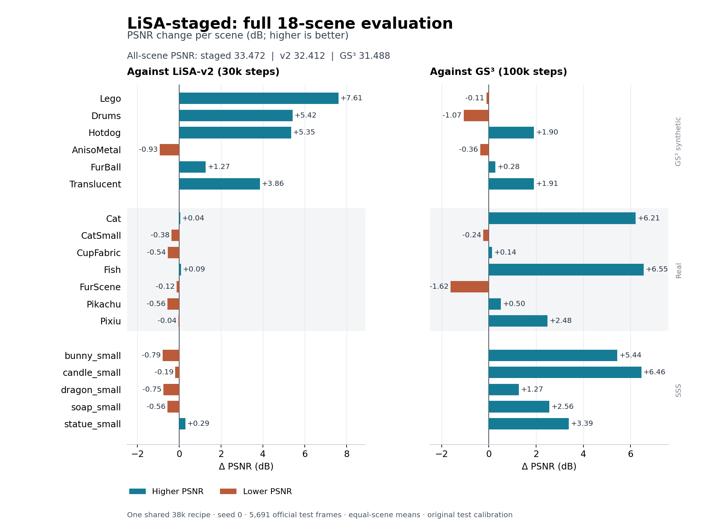
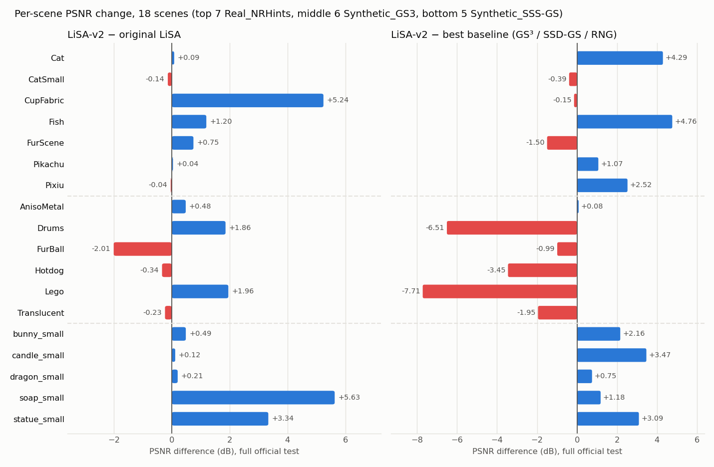

# LiSA：三类数据集完整实验记录

覆盖Real_NRHints 7场景、Synthetic_GS3 6场景、Synthetic_SSS-GS 5场景。
2026-10-04 LiSA-staged全18场景完成，原LiSA-v2与LiSA记录保留。中央collector已核验六方法108/108项。

[环境与协议](setup.md) · [六方法完整对比](../../../benchmarks/full_dataset_comparison/RESULTS.md) · [机器记录](radiometric_curriculum_results.json)

## LiSA-staged（2026-10-04，最新完整结果）

同一30k+8k流程：8k几何预热/辐射目标过渡、22k线性域联合训练、8k固定几何的观测域像素外观精修。
从训练轮廓初始化自身3DGS，无外部几何或预训练；全部official train、seed0、固定最后权重、原始标定完整official test。
18场景共5691帧，参数只保留原家族的观察/相机协议差异；没有逐场景选型。
预算38k，v2/原LiSA为30k、GS³为100k；结果按场景等权，非等预算比较。

| 范围 | PSNR ↑ | SSIM ↑ | LPIPS ↓ | ΔPSNR vs v2 | ΔPSNR vs GS³ |
|---|---:|---:|---:|---:|---:|
| all | 33.4722 | 0.95199 | 0.05636 | +1.0600 | +1.9837 |
| Synthetic_GS3 | 32.4001 | 0.97042 | 0.03823 | +3.7629 | +0.4269 |
| Real_NRHints | 29.2779 | 0.90938 | 0.10050 | -0.2157 | +2.0042 |
| Synthetic_SSS-GS | 40.6308 | 0.98951 | 0.01633 | -0.3976 | +3.8233 |

| 场景 | PSNR ↑ | SSIM ↑ | LPIPS ↓ | ΔPSNR vs v2 | ΔPSNR vs GS³ |
|---|---:|---:|---:|---:|---:|
| [Lego](../../runs/lisa_staged_full_dataset_20261004/Synthetic_GS3/Lego/appearance/test/metrics.json) | 30.8007 | 0.95861 | 0.04444 | +7.6091 | -0.1053 |
| [Drums](../../runs/lisa_staged_full_dataset_20261004/Synthetic_GS3/Drums/appearance/test/metrics.json) | 30.4515 | 0.97646 | 0.03036 | +5.4169 | -1.0652 |
| [Hotdog](../../runs/lisa_staged_full_dataset_20261004/Synthetic_GS3/Hotdog/appearance/test/metrics.json) | 35.2193 | 0.97991 | 0.02863 | +5.3546 | +1.9040 |
| [AnisoMetal](../../runs/lisa_staged_full_dataset_20261004/Synthetic_GS3/AnisoMetal/appearance/test/metrics.json) | 27.1484 | 0.95606 | 0.04045 | -0.9342 | -0.3647 |
| [FurBall](../../runs/lisa_staged_full_dataset_20261004/Synthetic_GS3/FurBall/appearance/test/metrics.json) | 36.1127 | 0.97091 | 0.05429 | +1.2696 | +0.2808 |
| [Translucent](../../runs/lisa_staged_full_dataset_20261004/Synthetic_GS3/Translucent/appearance/test/metrics.json) | 34.6681 | 0.98056 | 0.03124 | +3.8617 | +1.9116 |
| [Cat](../../runs/lisa_staged_full_dataset_20261004/Real_NRHints/Cat/appearance/test/metrics.json) | 25.3288 | 0.82077 | 0.17067 | +0.0444 | +6.2090 |
| [CatSmall](../../runs/lisa_staged_full_dataset_20261004/Real_NRHints/CatSmall/appearance/test/metrics.json) | 33.0169 | 0.96099 | 0.08158 | -0.3769 | -0.2357 |
| [CupFabric](../../runs/lisa_staged_full_dataset_20261004/Real_NRHints/CupFabric/appearance/test/metrics.json) | 35.3071 | 0.97593 | 0.05873 | -0.5388 | +0.1356 |
| [Fish](../../runs/lisa_staged_full_dataset_20261004/Real_NRHints/Fish/appearance/test/metrics.json) | 28.9666 | 0.89583 | 0.11053 | +0.0889 | +6.5539 |
| [FurScene](../../runs/lisa_staged_full_dataset_20261004/Real_NRHints/FurScene/appearance/test/metrics.json) | 24.4741 | 0.86376 | 0.11947 | -0.1198 | -1.6163 |
| [Pikachu](../../runs/lisa_staged_full_dataset_20261004/Real_NRHints/Pikachu/appearance/test/metrics.json) | 31.6486 | 0.96707 | 0.05557 | -0.5644 | +0.5019 |
| [Pixiu](../../runs/lisa_staged_full_dataset_20261004/Real_NRHints/Pixiu/appearance/test/metrics.json) | 26.2028 | 0.88136 | 0.10695 | -0.0436 | +2.4810 |
| [bunny_small](../../runs/lisa_staged_full_dataset_20261004/Synthetic_SSS-GS/bunny_small/appearance/test/metrics.json) | 39.8574 | 0.98964 | 0.01608 | -0.7856 | +5.4393 |
| [candle_small](../../runs/lisa_staged_full_dataset_20261004/Synthetic_SSS-GS/candle_small/appearance/test/metrics.json) | 45.1956 | 0.99596 | 0.00754 | -0.1860 | +6.4553 |
| [dragon_small](../../runs/lisa_staged_full_dataset_20261004/Synthetic_SSS-GS/dragon_small/appearance/test/metrics.json) | 37.3783 | 0.98118 | 0.02620 | -0.7499 | +1.2715 |
| [soap_small](../../runs/lisa_staged_full_dataset_20261004/Synthetic_SSS-GS/soap_small/appearance/test/metrics.json) | 40.9056 | 0.99159 | 0.01225 | -0.5607 | +2.5626 |
| [statue_small](../../runs/lisa_staged_full_dataset_20261004/Synthetic_SSS-GS/statue_small/appearance/test/metrics.json) | 39.8173 | 0.98919 | 0.01958 | +0.2943 | +3.3876 |

总体相对v2：PSNR +1.0600dB、SSIM +.00533、LPIPS −.00518；三项均值均为本地六方法最佳。
但PSNR仅8/18场景上升，SSIM为7/18、LPIPS为6/18；Real和SSS三项均值均略退。
Lego/Drums大幅改善；AnisoMetal回退.9342dB，FurScene仍低于GS³ 1.6163dB。
FurBall超过v2和GS³，但相对原LiSA36.8497/.97363/.04345仍未完全恢复，PSNR低.7370dB。

匹配16k训练内留出支持辐射目标及过渡整体有效；完整38k配方首次全跑就是本轮实验。
细亮高光与内部细节的残余误差分解、预验证范围及未隔离的机制见[分析](shading_refinement.md)。
完成时两张GPU均释放；纯v2的Git标签及原模型保留，本轮代码未混入标签。

以下保留v2与原LiSA历史结果，不以新结果覆盖。

## LiSA-v2（2026-10-04，历史对照）

根因修复后的配方：原LiSA + `--mask-weight 0.5` + `--foreground-appearance-until 2000` + `--specular lobes`；
同一30k预算、seed0、原增密、全official train、完整official test原始标定、最终权重。变体只在train内留出上选择（未用test）。
[根因与选型记录](lisa_v2_root_causes_20261004.md) · [机器记录](records_lisa_v2.json) · [对比总表](../../../benchmarks/full_dataset_comparison/RESULTS.md)

| 范围 | 场景数 | PSNR ↑ | SSIM ↑ | LPIPS ↓ | 原LiSA PSNR | 最强baseline PSNR |
| --- | ---: | ---: | ---: | ---: | ---: | ---: |
| all | 18 | 32.4122 | 0.9467 | 0.0615 | 31.3760 | SSD-GS 31.5819 |
| Real_NRHints | 7 | 29.4936 | 0.9105 | 0.0965 | 28.4729 | GS3 27.2736 |
| Synthetic_GS3 | 6 | 28.6372 | 0.9520 | 0.0593 | 28.3498 | GS3 31.9732 |
| Synthetic_SSS-GS | 5 | 41.0284 | 0.9909 | 0.0153 | 39.0717 | SSD-GS 37.7869 |

| 场景 | PSNR ↑ | SSIM ↑ | LPIPS ↓ | 相对原LiSA | 相对最强baseline | 原始指标 |
| --- | ---: | ---: | ---: | ---: | ---: | --- |
| Cat | 25.2843 | 0.8208 | 0.1675 | +0.09 | +4.29（RNG） | [metrics.json](../../runs/lisa_v2_full_dataset_20261004/lisa_v2/Real_NRHints/Cat/test/metrics.json) |
| CatSmall | 33.3938 | 0.9636 | 0.0735 | -0.14 | -0.39（SSD-GS） | [metrics.json](../../runs/lisa_v2_full_dataset_20261004/lisa_v2/Real_NRHints/CatSmall/test/metrics.json) |
| CupFabric | 35.8460 | 0.9791 | 0.0518 | +5.24 | -0.15（SSD-GS） | [metrics.json](../../runs/lisa_v2_full_dataset_20261004/lisa_v2/Real_NRHints/CupFabric/test/metrics.json) |
| Fish | 28.8777 | 0.8942 | 0.1102 | +1.20 | +4.76（RNG） | [metrics.json](../../runs/lisa_v2_full_dataset_20261004/lisa_v2/Real_NRHints/Fish/test/metrics.json) |
| FurScene | 24.5939 | 0.8653 | 0.1164 | +0.75 | -1.50（GS3） | [metrics.json](../../runs/lisa_v2_full_dataset_20261004/lisa_v2/Real_NRHints/FurScene/test/metrics.json) |
| Pikachu | 32.2129 | 0.9694 | 0.0522 | +0.04 | +1.07（GS3） | [metrics.json](../../runs/lisa_v2_full_dataset_20261004/lisa_v2/Real_NRHints/Pikachu/test/metrics.json) |
| Pixiu | 26.2464 | 0.8810 | 0.1036 | -0.04 | +2.52（GS3） | [metrics.json](../../runs/lisa_v2_full_dataset_20261004/lisa_v2/Real_NRHints/Pixiu/test/metrics.json) |
| AnisoMetal | 28.0826 | 0.9618 | 0.0370 | +0.48 | +0.08（SSD-GS） | [metrics.json](../../runs/lisa_v2_full_dataset_20261004/lisa_v2/Synthetic_GS3/AnisoMetal/test/metrics.json) |
| Drums | 25.0346 | 0.9531 | 0.0512 | +1.86 | -6.51（SSD-GS） | [metrics.json](../../runs/lisa_v2_full_dataset_20261004/lisa_v2/Synthetic_GS3/Drums/test/metrics.json) |
| FurBall | 34.8432 | 0.9665 | 0.0598 | -2.01 | -0.99（GS3） | [metrics.json](../../runs/lisa_v2_full_dataset_20261004/lisa_v2/Synthetic_GS3/FurBall/test/metrics.json) |
| Hotdog | 29.8647 | 0.9669 | 0.0452 | -0.34 | -3.45（GS3） | [metrics.json](../../runs/lisa_v2_full_dataset_20261004/lisa_v2/Synthetic_GS3/Hotdog/test/metrics.json) |
| Lego | 23.1916 | 0.8879 | 0.1303 | +1.96 | -7.71（GS3） | [metrics.json](../../runs/lisa_v2_full_dataset_20261004/lisa_v2/Synthetic_GS3/Lego/test/metrics.json) |
| Translucent | 30.8064 | 0.9757 | 0.0325 | -0.23 | -1.95（GS3） | [metrics.json](../../runs/lisa_v2_full_dataset_20261004/lisa_v2/Synthetic_GS3/Translucent/test/metrics.json) |
| bunny_small | 40.6430 | 0.9914 | 0.0163 | +0.49 | +2.16（SSD-GS） | [metrics.json](../../runs/lisa_v2_full_dataset_20261004/lisa_v2/Synthetic_SSS-GS/bunny_small/test/metrics.json) |
| candle_small | 45.3816 | 0.9965 | 0.0072 | +0.12 | +3.47（RNG） | [metrics.json](../../runs/lisa_v2_full_dataset_20261004/lisa_v2/Synthetic_SSS-GS/candle_small/test/metrics.json) |
| dragon_small | 38.1282 | 0.9835 | 0.0234 | +0.21 | +0.75（SSD-GS） | [metrics.json](../../runs/lisa_v2_full_dataset_20261004/lisa_v2/Synthetic_SSS-GS/dragon_small/test/metrics.json) |
| soap_small | 41.4662 | 0.9926 | 0.0112 | +5.63 | +1.18（RNG） | [metrics.json](../../runs/lisa_v2_full_dataset_20261004/lisa_v2/Synthetic_SSS-GS/soap_small/test/metrics.json) |
| statue_small | 39.5230 | 0.9905 | 0.0185 | +3.34 | +3.09（GS3） | [metrics.json](../../runs/lisa_v2_full_dataset_20261004/lisa_v2/Synthetic_SSS-GS/statue_small/test/metrics.json) |

以下为原LiSA（2026-10-03）记录，保持不变。

# 原LiSA（2026-10-03）

## 固定协议与结果口径

最终配置为 light_atlas + svbrdf 材质头；每场景30k步、seed0、原生3DGS从头初始化，无外部预训练或几何先验。真实场景仅训练相机旋转优化及平移规范，测试使用原始标定。此前六场景参与过研发观察，不能把整个研发流程描述为独立盲测。

共享 ssd-gs：Python 3.10 / PyTorch 2.4.1 / CUDA 12.1 / gsplat 1.5.3。

全部official train、完整official test，固定最后checkpoint，测试原始相机与灯位，无测试时拟合。Real/GS3最长边512px，SSS256px；Synthetic_GS3白底、线性HDR与gamma2.2展示，其余黑底。PSNR单位RGB、11×11 sigma1.5零padding SSIM、标准VGG LPIPS[-1,1]。先对每场景完整测试帧取均值，再对场景等权平均；单种子，各方法训练预算不同。

## 平均指标

| 范围 | 场景数 | PSNR ↑ | SSIM ↑ | LPIPS ↓ |
| --- | ---: | ---: | ---: | ---: |
| all | 18 | 31.3760 | 0.9431 | 0.0646 |
| Real_NRHints | 7 | 28.4729 | 0.9072 | 0.0988 |
| Synthetic_GS3 | 6 | 28.3498 | 0.9480 | 0.0622 |
| Synthetic_SSS-GS | 5 | 39.0717 | 0.9874 | 0.0196 |

## Real_NRHints

| 场景 | train/test | 步数 | PSNR ↑ | SSIM ↑ | LPIPS ↓ | 原始指标 |
| --- | ---: | ---: | ---: | ---: | ---: | --- |
| Cat | 522/66 | 30000 | 25.1991 | 0.8197 | 0.1671 | [metrics.json](../../runs/light_atlas_svbrdf_six_scene_20261002/lisa_svbrdf/Real_NRHints/Cat/test/metrics.json) |
| CatSmall | 1258/158 | 30000 | 33.5302 | 0.9642 | 0.0721 | [metrics.json](../../runs/light_atlas_svbrdf_remaining_scenes/lisa_svbrdf/Real_NRHints/CatSmall/test/metrics.json) |
| CupFabric | 1153/145 | 30000 | 30.6019 | 0.9670 | 0.0650 | [metrics.json](../../runs/light_atlas_svbrdf_remaining_scenes/lisa_svbrdf/Real_NRHints/CupFabric/test/metrics.json) |
| Fish | 526/66 | 30000 | 27.6822 | 0.8893 | 0.1091 | [metrics.json](../../runs/light_atlas_svbrdf_remaining_scenes/lisa_svbrdf/Real_NRHints/Fish/test/metrics.json) |
| FurScene | 676/85 | 30000 | 23.8440 | 0.8599 | 0.1246 | [metrics.json](../../runs/light_atlas_svbrdf_hard_scenes/lisa_svbrdf/Real_NRHints/FurScene/test/metrics.json) |
| Pikachu | 1500/200 | 30000 | 32.1703 | 0.9691 | 0.0524 | [metrics.json](../../runs/light_atlas_svbrdf_remaining_scenes/lisa_svbrdf/Real_NRHints/Pikachu/test/metrics.json) |
| Pixiu | 562/71 | 30000 | 26.2828 | 0.8810 | 0.1015 | [metrics.json](../../runs/light_atlas_svbrdf_six_scene_20261002/lisa_svbrdf/Real_NRHints/Pixiu/test/metrics.json) |

## Synthetic_GS3

| 场景 | train/test | 步数 | PSNR ↑ | SSIM ↑ | LPIPS ↓ | 原始指标 |
| --- | ---: | ---: | ---: | ---: | ---: | --- |
| AnisoMetal | 2000/400 | 30000 | 27.5993 | 0.9606 | 0.0366 | [metrics.json](../../runs/light_atlas_svbrdf_six_scene_20261002/lisa_svbrdf/Synthetic_GS3/AnisoMetal/test/metrics.json) |
| Drums | 2000/400 | 30000 | 23.1751 | 0.9450 | 0.0626 | [metrics.json](../../runs/light_atlas_svbrdf_hard_scenes/lisa_svbrdf/Synthetic_GS3/Drums/test/metrics.json) |
| FurBall | 2000/400 | 30000 | 36.8497 | 0.9736 | 0.0435 | [metrics.json](../../runs/light_atlas_svbrdf_remaining_scenes/lisa_svbrdf/Synthetic_GS3/FurBall/test/metrics.json) |
| Hotdog | 2000/400 | 30000 | 30.2002 | 0.9686 | 0.0425 | [metrics.json](../../runs/light_atlas_svbrdf_remaining_scenes/lisa_svbrdf/Synthetic_GS3/Hotdog/test/metrics.json) |
| Lego | 2000/400 | 30000 | 21.2351 | 0.8639 | 0.1561 | [metrics.json](../../runs/light_atlas_svbrdf_remaining_scenes/lisa_svbrdf/Synthetic_GS3/Lego/test/metrics.json) |
| Translucent | 2000/400 | 30000 | 31.0396 | 0.9762 | 0.0323 | [metrics.json](../../runs/light_atlas_svbrdf_six_scene_20261002/lisa_svbrdf/Synthetic_GS3/Translucent/test/metrics.json) |

## Synthetic_SSS-GS

| 场景 | train/test | 步数 | PSNR ↑ | SSIM ↑ | LPIPS ↓ | 原始指标 |
| --- | ---: | ---: | ---: | ---: | ---: | --- |
| bunny_small | 500/500 | 30000 | 40.1564 | 0.9913 | 0.0165 | [metrics.json](../../runs/light_atlas_svbrdf_six_scene_20261002/lisa_svbrdf/Synthetic_SSS-GS/bunny_small/test/metrics.json) |
| candle_small | 500/500 | 30000 | 45.2610 | 0.9966 | 0.0067 | [metrics.json](../../runs/light_atlas_svbrdf_remaining_scenes/lisa_svbrdf/Synthetic_SSS-GS/candle_small/test/metrics.json) |
| dragon_small | 500/500 | 30000 | 37.9232 | 0.9831 | 0.0239 | [metrics.json](../../runs/light_atlas_svbrdf_six_scene_20261002/lisa_svbrdf/Synthetic_SSS-GS/dragon_small/test/metrics.json) |
| soap_small | 500/500 | 30000 | 35.8331 | 0.9812 | 0.0224 | [metrics.json](../../runs/light_atlas_svbrdf_remaining_scenes/lisa_svbrdf/Synthetic_SSS-GS/soap_small/test/metrics.json) |
| statue_small | 500/500 | 30000 | 36.1847 | 0.9847 | 0.0285 | [metrics.json](../../runs/light_atlas_svbrdf_hard_scenes/lisa_svbrdf/Synthetic_SSS-GS/statue_small/test/metrics.json) |

## 逐场景完整证据

权重、数据、原始日志及不可变源码快照留在原位置。下列链接和records.json将分散批次合并为一个可追溯入口；原始配置中的旧pending/failed字段仅是历史快照，正式完成状态以本页和中央审计为准。存量记录未保存的信息不反推或补造。

### Real_NRHints/Cat

[输出目录](../../runs/light_atlas_svbrdf_six_scene_20261002/lisa_svbrdf/Real_NRHints/Cat) · [最终权重](../../runs/light_atlas_svbrdf_six_scene_20261002/lisa_svbrdf/Real_NRHints/Cat/last.pt) · [评估指标](../../runs/light_atlas_svbrdf_six_scene_20261002/lisa_svbrdf/Real_NRHints/Cat/test/metrics.json) · [训练源码快照](../../runs/light_atlas_svbrdf_six_scene_20261002/source.tar)

- 配置：[config.json](../../runs/light_atlas_svbrdf_six_scene_20261002/lisa_svbrdf/Real_NRHints/Cat/config.json)
- 命令与阶段记录：[benchmarks/full_dataset_comparison/comparison_manifest.json](../../../benchmarks/full_dataset_comparison/comparison_manifest.json) · [PORT-GS/runs/light_atlas_svbrdf_six_scene_20261002/manifest.json](../../runs/light_atlas_svbrdf_six_scene_20261002/manifest.json) · [PORT-GS/runs/light_atlas_svbrdf_six_scene_20261002/status.json](../../runs/light_atlas_svbrdf_six_scene_20261002/status.json)
- 原始日志：[Cat.test.log](../../runs/light_atlas_svbrdf_six_scene_20261002/lisa_svbrdf/Real_NRHints/Cat.test.log) · [Cat.train.log](../../runs/light_atlas_svbrdf_six_scene_20261002/lisa_svbrdf/Real_NRHints/Cat.train.log)
- 环境及代码版本：见源码快照、命令清单及setup.md；未记录的历史版本不推定。

### Real_NRHints/CatSmall

[输出目录](../../runs/light_atlas_svbrdf_remaining_scenes/lisa_svbrdf/Real_NRHints/CatSmall) · [最终权重](../../runs/light_atlas_svbrdf_remaining_scenes/lisa_svbrdf/Real_NRHints/CatSmall/last.pt) · [评估指标](../../runs/light_atlas_svbrdf_remaining_scenes/lisa_svbrdf/Real_NRHints/CatSmall/test/metrics.json) · [训练源码快照](../../runs/light_atlas_svbrdf_remaining_scenes/source.tar)

- 配置：[config.json](../../runs/light_atlas_svbrdf_remaining_scenes/lisa_svbrdf/Real_NRHints/CatSmall/config.json)
- 命令与阶段记录：[benchmarks/full_dataset_comparison/comparison_manifest.json](../../../benchmarks/full_dataset_comparison/comparison_manifest.json) · [benchmarks/full_dataset_comparison/jobs.json](../../../benchmarks/full_dataset_comparison/jobs.json) · [benchmarks/full_dataset_comparison/queue_state.json](../../../benchmarks/full_dataset_comparison/queue_state.json) · [PORT-GS/runs/light_atlas_svbrdf_remaining_scenes/jobs.json](../../runs/light_atlas_svbrdf_remaining_scenes/jobs.json) · [PORT-GS/runs/light_atlas_svbrdf_remaining_scenes/manifest.json](../../runs/light_atlas_svbrdf_remaining_scenes/manifest.json)
- 原始日志：[CatSmall.test.log](../../runs/light_atlas_svbrdf_remaining_scenes/lisa_svbrdf/Real_NRHints/CatSmall.test.log) · [CatSmall.train.log](../../runs/light_atlas_svbrdf_remaining_scenes/lisa_svbrdf/Real_NRHints/CatSmall.train.log)
- 环境及代码版本：[environment.txt](../../runs/light_atlas_svbrdf_remaining_scenes/environment.txt) · [provenance.json](../../runs/light_atlas_svbrdf_remaining_scenes/provenance.json)

### Real_NRHints/CupFabric

[输出目录](../../runs/light_atlas_svbrdf_remaining_scenes/lisa_svbrdf/Real_NRHints/CupFabric) · [最终权重](../../runs/light_atlas_svbrdf_remaining_scenes/lisa_svbrdf/Real_NRHints/CupFabric/last.pt) · [评估指标](../../runs/light_atlas_svbrdf_remaining_scenes/lisa_svbrdf/Real_NRHints/CupFabric/test/metrics.json) · [训练源码快照](../../runs/light_atlas_svbrdf_remaining_scenes/source.tar)

- 配置：[config.json](../../runs/light_atlas_svbrdf_remaining_scenes/lisa_svbrdf/Real_NRHints/CupFabric/config.json)
- 命令与阶段记录：[benchmarks/full_dataset_comparison/comparison_manifest.json](../../../benchmarks/full_dataset_comparison/comparison_manifest.json) · [benchmarks/full_dataset_comparison/jobs.json](../../../benchmarks/full_dataset_comparison/jobs.json) · [benchmarks/full_dataset_comparison/queue_state.json](../../../benchmarks/full_dataset_comparison/queue_state.json) · [PORT-GS/runs/light_atlas_svbrdf_remaining_scenes/jobs.json](../../runs/light_atlas_svbrdf_remaining_scenes/jobs.json) · [PORT-GS/runs/light_atlas_svbrdf_remaining_scenes/manifest.json](../../runs/light_atlas_svbrdf_remaining_scenes/manifest.json)
- 原始日志：[CupFabric.test.log](../../runs/light_atlas_svbrdf_remaining_scenes/lisa_svbrdf/Real_NRHints/CupFabric.test.log) · [CupFabric.train.log](../../runs/light_atlas_svbrdf_remaining_scenes/lisa_svbrdf/Real_NRHints/CupFabric.train.log)
- 环境及代码版本：[environment.txt](../../runs/light_atlas_svbrdf_remaining_scenes/environment.txt) · [provenance.json](../../runs/light_atlas_svbrdf_remaining_scenes/provenance.json)

### Real_NRHints/Fish

[输出目录](../../runs/light_atlas_svbrdf_remaining_scenes/lisa_svbrdf/Real_NRHints/Fish) · [最终权重](../../runs/light_atlas_svbrdf_remaining_scenes/lisa_svbrdf/Real_NRHints/Fish/last.pt) · [评估指标](../../runs/light_atlas_svbrdf_remaining_scenes/lisa_svbrdf/Real_NRHints/Fish/test/metrics.json) · [训练源码快照](../../runs/light_atlas_svbrdf_remaining_scenes/source.tar)

- 配置：[config.json](../../runs/light_atlas_svbrdf_remaining_scenes/lisa_svbrdf/Real_NRHints/Fish/config.json)
- 命令与阶段记录：[benchmarks/full_dataset_comparison/comparison_manifest.json](../../../benchmarks/full_dataset_comparison/comparison_manifest.json) · [benchmarks/full_dataset_comparison/jobs.json](../../../benchmarks/full_dataset_comparison/jobs.json) · [benchmarks/full_dataset_comparison/queue_state.json](../../../benchmarks/full_dataset_comparison/queue_state.json) · [PORT-GS/runs/light_atlas_svbrdf_remaining_scenes/jobs.json](../../runs/light_atlas_svbrdf_remaining_scenes/jobs.json) · [PORT-GS/runs/light_atlas_svbrdf_remaining_scenes/manifest.json](../../runs/light_atlas_svbrdf_remaining_scenes/manifest.json)
- 原始日志：[Fish.test.log](../../runs/light_atlas_svbrdf_remaining_scenes/lisa_svbrdf/Real_NRHints/Fish.test.log) · [Fish.train.log](../../runs/light_atlas_svbrdf_remaining_scenes/lisa_svbrdf/Real_NRHints/Fish.train.log)
- 环境及代码版本：[environment.txt](../../runs/light_atlas_svbrdf_remaining_scenes/environment.txt) · [provenance.json](../../runs/light_atlas_svbrdf_remaining_scenes/provenance.json)

### Real_NRHints/FurScene

[输出目录](../../runs/light_atlas_svbrdf_hard_scenes/lisa_svbrdf/Real_NRHints/FurScene) · [最终权重](../../runs/light_atlas_svbrdf_hard_scenes/lisa_svbrdf/Real_NRHints/FurScene/last.pt) · [评估指标](../../runs/light_atlas_svbrdf_hard_scenes/lisa_svbrdf/Real_NRHints/FurScene/test/metrics.json) · [训练源码快照](../../runs/light_atlas_svbrdf_hard_scenes/source.tar)

- 配置：[config.json](../../runs/light_atlas_svbrdf_hard_scenes/lisa_svbrdf/Real_NRHints/FurScene/config.json)
- 命令与阶段记录：[benchmarks/supplement_hard_scenes/comparison_manifest.json](../../../benchmarks/supplement_hard_scenes/comparison_manifest.json) · [benchmarks/full_dataset_comparison/comparison_manifest.json](../../../benchmarks/full_dataset_comparison/comparison_manifest.json) · [PORT-GS/runs/light_atlas_svbrdf_hard_scenes/manifest.json](../../runs/light_atlas_svbrdf_hard_scenes/manifest.json) · [PORT-GS/runs/light_atlas_svbrdf_hard_scenes/status.json](../../runs/light_atlas_svbrdf_hard_scenes/status.json)
- 原始日志：[FurScene.test.log](../../runs/light_atlas_svbrdf_hard_scenes/lisa_svbrdf/Real_NRHints/FurScene.test.log) · [FurScene.train.log](../../runs/light_atlas_svbrdf_hard_scenes/lisa_svbrdf/Real_NRHints/FurScene.train.log)
- 环境及代码版本：见源码快照、命令清单及setup.md；未记录的历史版本不推定。

### Real_NRHints/Pikachu

[输出目录](../../runs/light_atlas_svbrdf_remaining_scenes/lisa_svbrdf/Real_NRHints/Pikachu) · [最终权重](../../runs/light_atlas_svbrdf_remaining_scenes/lisa_svbrdf/Real_NRHints/Pikachu/last.pt) · [评估指标](../../runs/light_atlas_svbrdf_remaining_scenes/lisa_svbrdf/Real_NRHints/Pikachu/test/metrics.json) · [训练源码快照](../../runs/light_atlas_svbrdf_remaining_scenes/source.tar)

- 配置：[config.json](../../runs/light_atlas_svbrdf_remaining_scenes/lisa_svbrdf/Real_NRHints/Pikachu/config.json)
- 命令与阶段记录：[benchmarks/full_dataset_comparison/comparison_manifest.json](../../../benchmarks/full_dataset_comparison/comparison_manifest.json) · [benchmarks/full_dataset_comparison/jobs.json](../../../benchmarks/full_dataset_comparison/jobs.json) · [benchmarks/full_dataset_comparison/queue_state.json](../../../benchmarks/full_dataset_comparison/queue_state.json) · [PORT-GS/runs/light_atlas_svbrdf_remaining_scenes/jobs.json](../../runs/light_atlas_svbrdf_remaining_scenes/jobs.json) · [PORT-GS/runs/light_atlas_svbrdf_remaining_scenes/manifest.json](../../runs/light_atlas_svbrdf_remaining_scenes/manifest.json)
- 原始日志：[Pikachu.test.log](../../runs/light_atlas_svbrdf_remaining_scenes/lisa_svbrdf/Real_NRHints/Pikachu.test.log) · [Pikachu.train.log](../../runs/light_atlas_svbrdf_remaining_scenes/lisa_svbrdf/Real_NRHints/Pikachu.train.log)
- 环境及代码版本：[environment.txt](../../runs/light_atlas_svbrdf_remaining_scenes/environment.txt) · [provenance.json](../../runs/light_atlas_svbrdf_remaining_scenes/provenance.json)

### Real_NRHints/Pixiu

[输出目录](../../runs/light_atlas_svbrdf_six_scene_20261002/lisa_svbrdf/Real_NRHints/Pixiu) · [最终权重](../../runs/light_atlas_svbrdf_six_scene_20261002/lisa_svbrdf/Real_NRHints/Pixiu/last.pt) · [评估指标](../../runs/light_atlas_svbrdf_six_scene_20261002/lisa_svbrdf/Real_NRHints/Pixiu/test/metrics.json) · [训练源码快照](../../runs/light_atlas_svbrdf_six_scene_20261002/source.tar)

- 配置：[config.json](../../runs/light_atlas_svbrdf_six_scene_20261002/lisa_svbrdf/Real_NRHints/Pixiu/config.json)
- 命令与阶段记录：[benchmarks/full_dataset_comparison/comparison_manifest.json](../../../benchmarks/full_dataset_comparison/comparison_manifest.json) · [PORT-GS/runs/light_atlas_svbrdf_six_scene_20261002/manifest.json](../../runs/light_atlas_svbrdf_six_scene_20261002/manifest.json) · [PORT-GS/runs/light_atlas_svbrdf_six_scene_20261002/status.json](../../runs/light_atlas_svbrdf_six_scene_20261002/status.json)
- 原始日志：[Pixiu.test.log](../../runs/light_atlas_svbrdf_six_scene_20261002/lisa_svbrdf/Real_NRHints/Pixiu.test.log) · [Pixiu.train.log](../../runs/light_atlas_svbrdf_six_scene_20261002/lisa_svbrdf/Real_NRHints/Pixiu.train.log)
- 环境及代码版本：见源码快照、命令清单及setup.md；未记录的历史版本不推定。

### Synthetic_GS3/AnisoMetal

[输出目录](../../runs/light_atlas_svbrdf_six_scene_20261002/lisa_svbrdf/Synthetic_GS3/AnisoMetal) · [最终权重](../../runs/light_atlas_svbrdf_six_scene_20261002/lisa_svbrdf/Synthetic_GS3/AnisoMetal/last.pt) · [评估指标](../../runs/light_atlas_svbrdf_six_scene_20261002/lisa_svbrdf/Synthetic_GS3/AnisoMetal/test/metrics.json) · [训练源码快照](../../runs/light_atlas_svbrdf_six_scene_20261002/source.tar)

- 配置：[config.json](../../runs/light_atlas_svbrdf_six_scene_20261002/lisa_svbrdf/Synthetic_GS3/AnisoMetal/config.json)
- 命令与阶段记录：[benchmarks/full_dataset_comparison/comparison_manifest.json](../../../benchmarks/full_dataset_comparison/comparison_manifest.json) · [PORT-GS/runs/light_atlas_svbrdf_six_scene_20261002/manifest.json](../../runs/light_atlas_svbrdf_six_scene_20261002/manifest.json) · [PORT-GS/runs/light_atlas_svbrdf_six_scene_20261002/status.json](../../runs/light_atlas_svbrdf_six_scene_20261002/status.json)
- 原始日志：[AnisoMetal.test.log](../../runs/light_atlas_svbrdf_six_scene_20261002/lisa_svbrdf/Synthetic_GS3/AnisoMetal.test.log) · [AnisoMetal.train.log](../../runs/light_atlas_svbrdf_six_scene_20261002/lisa_svbrdf/Synthetic_GS3/AnisoMetal.train.log)
- 环境及代码版本：见源码快照、命令清单及setup.md；未记录的历史版本不推定。

### Synthetic_GS3/Drums

[输出目录](../../runs/light_atlas_svbrdf_hard_scenes/lisa_svbrdf/Synthetic_GS3/Drums) · [最终权重](../../runs/light_atlas_svbrdf_hard_scenes/lisa_svbrdf/Synthetic_GS3/Drums/last.pt) · [评估指标](../../runs/light_atlas_svbrdf_hard_scenes/lisa_svbrdf/Synthetic_GS3/Drums/test/metrics.json) · [训练源码快照](../../runs/light_atlas_svbrdf_hard_scenes/source.tar)

- 配置：[config.json](../../runs/light_atlas_svbrdf_hard_scenes/lisa_svbrdf/Synthetic_GS3/Drums/config.json)
- 命令与阶段记录：[benchmarks/supplement_hard_scenes/comparison_manifest.json](../../../benchmarks/supplement_hard_scenes/comparison_manifest.json) · [benchmarks/full_dataset_comparison/comparison_manifest.json](../../../benchmarks/full_dataset_comparison/comparison_manifest.json) · [PORT-GS/runs/light_atlas_svbrdf_hard_scenes/manifest.json](../../runs/light_atlas_svbrdf_hard_scenes/manifest.json) · [PORT-GS/runs/light_atlas_svbrdf_hard_scenes/status.json](../../runs/light_atlas_svbrdf_hard_scenes/status.json)
- 原始日志：[Drums.test.log](../../runs/light_atlas_svbrdf_hard_scenes/lisa_svbrdf/Synthetic_GS3/Drums.test.log) · [Drums.train.log](../../runs/light_atlas_svbrdf_hard_scenes/lisa_svbrdf/Synthetic_GS3/Drums.train.log)
- 环境及代码版本：见源码快照、命令清单及setup.md；未记录的历史版本不推定。

### Synthetic_GS3/FurBall

[输出目录](../../runs/light_atlas_svbrdf_remaining_scenes/lisa_svbrdf/Synthetic_GS3/FurBall) · [最终权重](../../runs/light_atlas_svbrdf_remaining_scenes/lisa_svbrdf/Synthetic_GS3/FurBall/last.pt) · [评估指标](../../runs/light_atlas_svbrdf_remaining_scenes/lisa_svbrdf/Synthetic_GS3/FurBall/test/metrics.json) · [训练源码快照](../../runs/light_atlas_svbrdf_remaining_scenes/source.tar)

- 配置：[config.json](../../runs/light_atlas_svbrdf_remaining_scenes/lisa_svbrdf/Synthetic_GS3/FurBall/config.json)
- 命令与阶段记录：[benchmarks/full_dataset_comparison/comparison_manifest.json](../../../benchmarks/full_dataset_comparison/comparison_manifest.json) · [benchmarks/full_dataset_comparison/jobs.json](../../../benchmarks/full_dataset_comparison/jobs.json) · [benchmarks/full_dataset_comparison/queue_state.json](../../../benchmarks/full_dataset_comparison/queue_state.json) · [PORT-GS/runs/light_atlas_svbrdf_remaining_scenes/jobs.json](../../runs/light_atlas_svbrdf_remaining_scenes/jobs.json) · [PORT-GS/runs/light_atlas_svbrdf_remaining_scenes/manifest.json](../../runs/light_atlas_svbrdf_remaining_scenes/manifest.json)
- 原始日志：[FurBall.test.log](../../runs/light_atlas_svbrdf_remaining_scenes/lisa_svbrdf/Synthetic_GS3/FurBall.test.log) · [FurBall.train.log](../../runs/light_atlas_svbrdf_remaining_scenes/lisa_svbrdf/Synthetic_GS3/FurBall.train.log)
- 环境及代码版本：[environment.txt](../../runs/light_atlas_svbrdf_remaining_scenes/environment.txt) · [provenance.json](../../runs/light_atlas_svbrdf_remaining_scenes/provenance.json)

### Synthetic_GS3/Hotdog

[输出目录](../../runs/light_atlas_svbrdf_remaining_scenes/lisa_svbrdf/Synthetic_GS3/Hotdog) · [最终权重](../../runs/light_atlas_svbrdf_remaining_scenes/lisa_svbrdf/Synthetic_GS3/Hotdog/last.pt) · [评估指标](../../runs/light_atlas_svbrdf_remaining_scenes/lisa_svbrdf/Synthetic_GS3/Hotdog/test/metrics.json) · [训练源码快照](../../runs/light_atlas_svbrdf_remaining_scenes/source.tar)

- 配置：[config.json](../../runs/light_atlas_svbrdf_remaining_scenes/lisa_svbrdf/Synthetic_GS3/Hotdog/config.json)
- 命令与阶段记录：[benchmarks/full_dataset_comparison/comparison_manifest.json](../../../benchmarks/full_dataset_comparison/comparison_manifest.json) · [benchmarks/full_dataset_comparison/jobs.json](../../../benchmarks/full_dataset_comparison/jobs.json) · [benchmarks/full_dataset_comparison/queue_state.json](../../../benchmarks/full_dataset_comparison/queue_state.json) · [PORT-GS/runs/light_atlas_svbrdf_remaining_scenes/jobs.json](../../runs/light_atlas_svbrdf_remaining_scenes/jobs.json) · [PORT-GS/runs/light_atlas_svbrdf_remaining_scenes/manifest.json](../../runs/light_atlas_svbrdf_remaining_scenes/manifest.json)
- 原始日志：[Hotdog.test.log](../../runs/light_atlas_svbrdf_remaining_scenes/lisa_svbrdf/Synthetic_GS3/Hotdog.test.log) · [Hotdog.train.log](../../runs/light_atlas_svbrdf_remaining_scenes/lisa_svbrdf/Synthetic_GS3/Hotdog.train.log)
- 环境及代码版本：[environment.txt](../../runs/light_atlas_svbrdf_remaining_scenes/environment.txt) · [provenance.json](../../runs/light_atlas_svbrdf_remaining_scenes/provenance.json)

### Synthetic_GS3/Lego

[输出目录](../../runs/light_atlas_svbrdf_remaining_scenes/lisa_svbrdf/Synthetic_GS3/Lego) · [最终权重](../../runs/light_atlas_svbrdf_remaining_scenes/lisa_svbrdf/Synthetic_GS3/Lego/last.pt) · [评估指标](../../runs/light_atlas_svbrdf_remaining_scenes/lisa_svbrdf/Synthetic_GS3/Lego/test/metrics.json) · [训练源码快照](../../runs/light_atlas_svbrdf_remaining_scenes/source.tar)

- 配置：[config.json](../../runs/light_atlas_svbrdf_remaining_scenes/lisa_svbrdf/Synthetic_GS3/Lego/config.json)
- 命令与阶段记录：[benchmarks/full_dataset_comparison/comparison_manifest.json](../../../benchmarks/full_dataset_comparison/comparison_manifest.json) · [benchmarks/full_dataset_comparison/jobs.json](../../../benchmarks/full_dataset_comparison/jobs.json) · [benchmarks/full_dataset_comparison/queue_state.json](../../../benchmarks/full_dataset_comparison/queue_state.json) · [PORT-GS/runs/light_atlas_svbrdf_remaining_scenes/jobs.json](../../runs/light_atlas_svbrdf_remaining_scenes/jobs.json) · [PORT-GS/runs/light_atlas_svbrdf_remaining_scenes/manifest.json](../../runs/light_atlas_svbrdf_remaining_scenes/manifest.json)
- 原始日志：[Lego.test.log](../../runs/light_atlas_svbrdf_remaining_scenes/lisa_svbrdf/Synthetic_GS3/Lego.test.log) · [Lego.train.log](../../runs/light_atlas_svbrdf_remaining_scenes/lisa_svbrdf/Synthetic_GS3/Lego.train.log)
- 环境及代码版本：[environment.txt](../../runs/light_atlas_svbrdf_remaining_scenes/environment.txt) · [provenance.json](../../runs/light_atlas_svbrdf_remaining_scenes/provenance.json)

### Synthetic_GS3/Translucent

[输出目录](../../runs/light_atlas_svbrdf_six_scene_20261002/lisa_svbrdf/Synthetic_GS3/Translucent) · [最终权重](../../runs/light_atlas_svbrdf_six_scene_20261002/lisa_svbrdf/Synthetic_GS3/Translucent/last.pt) · [评估指标](../../runs/light_atlas_svbrdf_six_scene_20261002/lisa_svbrdf/Synthetic_GS3/Translucent/test/metrics.json) · [训练源码快照](../../runs/light_atlas_svbrdf_six_scene_20261002/source.tar)

- 配置：[config.json](../../runs/light_atlas_svbrdf_six_scene_20261002/lisa_svbrdf/Synthetic_GS3/Translucent/config.json)
- 命令与阶段记录：[benchmarks/full_dataset_comparison/comparison_manifest.json](../../../benchmarks/full_dataset_comparison/comparison_manifest.json) · [PORT-GS/runs/light_atlas_svbrdf_six_scene_20261002/manifest.json](../../runs/light_atlas_svbrdf_six_scene_20261002/manifest.json) · [PORT-GS/runs/light_atlas_svbrdf_six_scene_20261002/status.json](../../runs/light_atlas_svbrdf_six_scene_20261002/status.json)
- 原始日志：[Translucent.test.log](../../runs/light_atlas_svbrdf_six_scene_20261002/lisa_svbrdf/Synthetic_GS3/Translucent.test.log) · [Translucent.train.log](../../runs/light_atlas_svbrdf_six_scene_20261002/lisa_svbrdf/Synthetic_GS3/Translucent.train.log)
- 环境及代码版本：见源码快照、命令清单及setup.md；未记录的历史版本不推定。

### Synthetic_SSS-GS/bunny_small

[输出目录](../../runs/light_atlas_svbrdf_six_scene_20261002/lisa_svbrdf/Synthetic_SSS-GS/bunny_small) · [最终权重](../../runs/light_atlas_svbrdf_six_scene_20261002/lisa_svbrdf/Synthetic_SSS-GS/bunny_small/last.pt) · [评估指标](../../runs/light_atlas_svbrdf_six_scene_20261002/lisa_svbrdf/Synthetic_SSS-GS/bunny_small/test/metrics.json) · [训练源码快照](../../runs/light_atlas_svbrdf_six_scene_20261002/source.tar)

- 配置：[config.json](../../runs/light_atlas_svbrdf_six_scene_20261002/lisa_svbrdf/Synthetic_SSS-GS/bunny_small/config.json)
- 命令与阶段记录：[benchmarks/full_dataset_comparison/comparison_manifest.json](../../../benchmarks/full_dataset_comparison/comparison_manifest.json) · [PORT-GS/runs/light_atlas_svbrdf_six_scene_20261002/manifest.json](../../runs/light_atlas_svbrdf_six_scene_20261002/manifest.json) · [PORT-GS/runs/light_atlas_svbrdf_six_scene_20261002/status.json](../../runs/light_atlas_svbrdf_six_scene_20261002/status.json)
- 原始日志：[bunny_small.test.log](../../runs/light_atlas_svbrdf_six_scene_20261002/lisa_svbrdf/Synthetic_SSS-GS/bunny_small.test.log) · [bunny_small.train.log](../../runs/light_atlas_svbrdf_six_scene_20261002/lisa_svbrdf/Synthetic_SSS-GS/bunny_small.train.log)
- 环境及代码版本：见源码快照、命令清单及setup.md；未记录的历史版本不推定。

### Synthetic_SSS-GS/candle_small

[输出目录](../../runs/light_atlas_svbrdf_remaining_scenes/lisa_svbrdf/Synthetic_SSS-GS/candle_small) · [最终权重](../../runs/light_atlas_svbrdf_remaining_scenes/lisa_svbrdf/Synthetic_SSS-GS/candle_small/last.pt) · [评估指标](../../runs/light_atlas_svbrdf_remaining_scenes/lisa_svbrdf/Synthetic_SSS-GS/candle_small/test/metrics.json) · [训练源码快照](../../runs/light_atlas_svbrdf_remaining_scenes/source.tar)

- 配置：[config.json](../../runs/light_atlas_svbrdf_remaining_scenes/lisa_svbrdf/Synthetic_SSS-GS/candle_small/config.json)
- 命令与阶段记录：[benchmarks/full_dataset_comparison/comparison_manifest.json](../../../benchmarks/full_dataset_comparison/comparison_manifest.json) · [benchmarks/full_dataset_comparison/jobs.json](../../../benchmarks/full_dataset_comparison/jobs.json) · [benchmarks/full_dataset_comparison/queue_state.json](../../../benchmarks/full_dataset_comparison/queue_state.json) · [PORT-GS/runs/light_atlas_svbrdf_remaining_scenes/jobs.json](../../runs/light_atlas_svbrdf_remaining_scenes/jobs.json) · [PORT-GS/runs/light_atlas_svbrdf_remaining_scenes/manifest.json](../../runs/light_atlas_svbrdf_remaining_scenes/manifest.json)
- 原始日志：[candle_small.test.log](../../runs/light_atlas_svbrdf_remaining_scenes/lisa_svbrdf/Synthetic_SSS-GS/candle_small.test.log) · [candle_small.train.log](../../runs/light_atlas_svbrdf_remaining_scenes/lisa_svbrdf/Synthetic_SSS-GS/candle_small.train.log)
- 环境及代码版本：[environment.txt](../../runs/light_atlas_svbrdf_remaining_scenes/environment.txt) · [provenance.json](../../runs/light_atlas_svbrdf_remaining_scenes/provenance.json)

### Synthetic_SSS-GS/dragon_small

[输出目录](../../runs/light_atlas_svbrdf_six_scene_20261002/lisa_svbrdf/Synthetic_SSS-GS/dragon_small) · [最终权重](../../runs/light_atlas_svbrdf_six_scene_20261002/lisa_svbrdf/Synthetic_SSS-GS/dragon_small/last.pt) · [评估指标](../../runs/light_atlas_svbrdf_six_scene_20261002/lisa_svbrdf/Synthetic_SSS-GS/dragon_small/test/metrics.json) · [训练源码快照](../../runs/light_atlas_svbrdf_six_scene_20261002/source.tar)

- 配置：[config.json](../../runs/light_atlas_svbrdf_six_scene_20261002/lisa_svbrdf/Synthetic_SSS-GS/dragon_small/config.json)
- 命令与阶段记录：[benchmarks/full_dataset_comparison/comparison_manifest.json](../../../benchmarks/full_dataset_comparison/comparison_manifest.json) · [PORT-GS/runs/light_atlas_svbrdf_six_scene_20261002/manifest.json](../../runs/light_atlas_svbrdf_six_scene_20261002/manifest.json) · [PORT-GS/runs/light_atlas_svbrdf_six_scene_20261002/status.json](../../runs/light_atlas_svbrdf_six_scene_20261002/status.json)
- 原始日志：[dragon_small.test.log](../../runs/light_atlas_svbrdf_six_scene_20261002/lisa_svbrdf/Synthetic_SSS-GS/dragon_small.test.log) · [dragon_small.train.log](../../runs/light_atlas_svbrdf_six_scene_20261002/lisa_svbrdf/Synthetic_SSS-GS/dragon_small.train.log)
- 环境及代码版本：见源码快照、命令清单及setup.md；未记录的历史版本不推定。

### Synthetic_SSS-GS/soap_small

[输出目录](../../runs/light_atlas_svbrdf_remaining_scenes/lisa_svbrdf/Synthetic_SSS-GS/soap_small) · [最终权重](../../runs/light_atlas_svbrdf_remaining_scenes/lisa_svbrdf/Synthetic_SSS-GS/soap_small/last.pt) · [评估指标](../../runs/light_atlas_svbrdf_remaining_scenes/lisa_svbrdf/Synthetic_SSS-GS/soap_small/test/metrics.json) · [训练源码快照](../../runs/light_atlas_svbrdf_remaining_scenes/source.tar)

- 配置：[config.json](../../runs/light_atlas_svbrdf_remaining_scenes/lisa_svbrdf/Synthetic_SSS-GS/soap_small/config.json)
- 命令与阶段记录：[benchmarks/full_dataset_comparison/comparison_manifest.json](../../../benchmarks/full_dataset_comparison/comparison_manifest.json) · [benchmarks/full_dataset_comparison/jobs.json](../../../benchmarks/full_dataset_comparison/jobs.json) · [benchmarks/full_dataset_comparison/queue_state.json](../../../benchmarks/full_dataset_comparison/queue_state.json) · [PORT-GS/runs/light_atlas_svbrdf_remaining_scenes/jobs.json](../../runs/light_atlas_svbrdf_remaining_scenes/jobs.json) · [PORT-GS/runs/light_atlas_svbrdf_remaining_scenes/manifest.json](../../runs/light_atlas_svbrdf_remaining_scenes/manifest.json)
- 原始日志：[soap_small.test.log](../../runs/light_atlas_svbrdf_remaining_scenes/lisa_svbrdf/Synthetic_SSS-GS/soap_small.test.log) · [soap_small.train.log](../../runs/light_atlas_svbrdf_remaining_scenes/lisa_svbrdf/Synthetic_SSS-GS/soap_small.train.log)
- 环境及代码版本：[environment.txt](../../runs/light_atlas_svbrdf_remaining_scenes/environment.txt) · [provenance.json](../../runs/light_atlas_svbrdf_remaining_scenes/provenance.json)

### Synthetic_SSS-GS/statue_small

[输出目录](../../runs/light_atlas_svbrdf_hard_scenes/lisa_svbrdf/Synthetic_SSS-GS/statue_small) · [最终权重](../../runs/light_atlas_svbrdf_hard_scenes/lisa_svbrdf/Synthetic_SSS-GS/statue_small/last.pt) · [评估指标](../../runs/light_atlas_svbrdf_hard_scenes/lisa_svbrdf/Synthetic_SSS-GS/statue_small/test/metrics.json) · [训练源码快照](../../runs/light_atlas_svbrdf_hard_scenes/source.tar)

- 配置：[config.json](../../runs/light_atlas_svbrdf_hard_scenes/lisa_svbrdf/Synthetic_SSS-GS/statue_small/config.json)
- 命令与阶段记录：[benchmarks/supplement_hard_scenes/comparison_manifest.json](../../../benchmarks/supplement_hard_scenes/comparison_manifest.json) · [benchmarks/full_dataset_comparison/comparison_manifest.json](../../../benchmarks/full_dataset_comparison/comparison_manifest.json) · [PORT-GS/runs/light_atlas_svbrdf_hard_scenes/manifest.json](../../runs/light_atlas_svbrdf_hard_scenes/manifest.json) · [PORT-GS/runs/light_atlas_svbrdf_hard_scenes/status.json](../../runs/light_atlas_svbrdf_hard_scenes/status.json)
- 原始日志：[statue_small.test.log](../../runs/light_atlas_svbrdf_hard_scenes/lisa_svbrdf/Synthetic_SSS-GS/statue_small.test.log) · [statue_small.train.log](../../runs/light_atlas_svbrdf_hard_scenes/lisa_svbrdf/Synthetic_SSS-GS/statue_small.train.log)
- 环境及代码版本：见源码快照、命令清单及setup.md；未记录的历史版本不推定。

## 研发实验的区别

[材质头选择、消融及留出光照实验](development.md)是独立研发证据，不混入上述18场景均值。原六场景泄漏审计已并入[协议](setup.md)，审计范围不自动扩展为18场景的全量训练历史审计。SOTA与成因分析仍按用户要求暂停。
